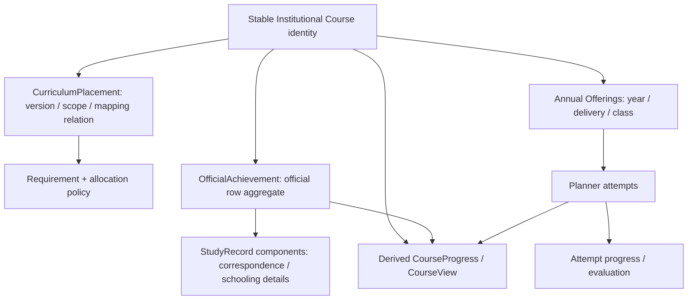
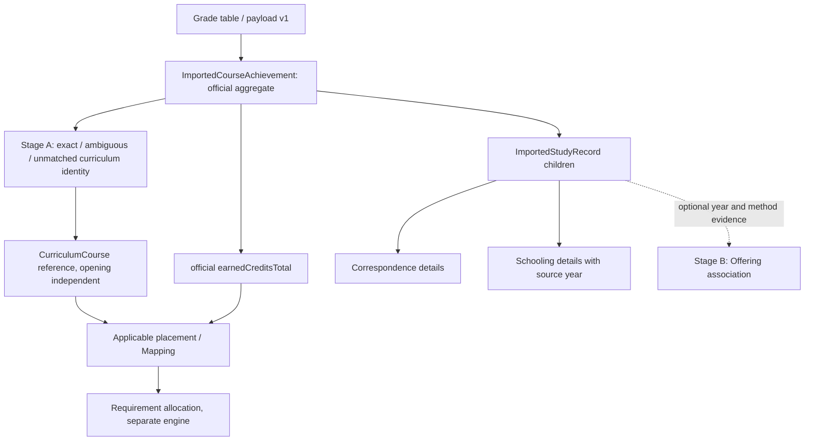
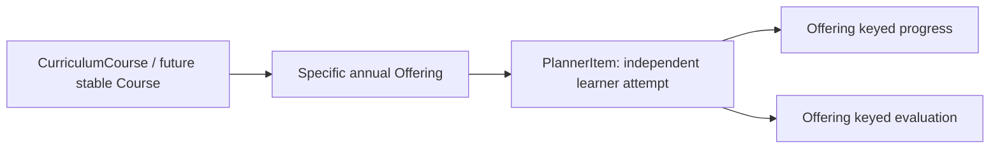
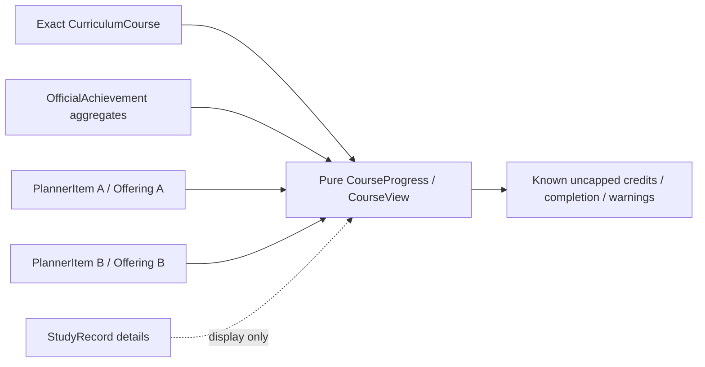
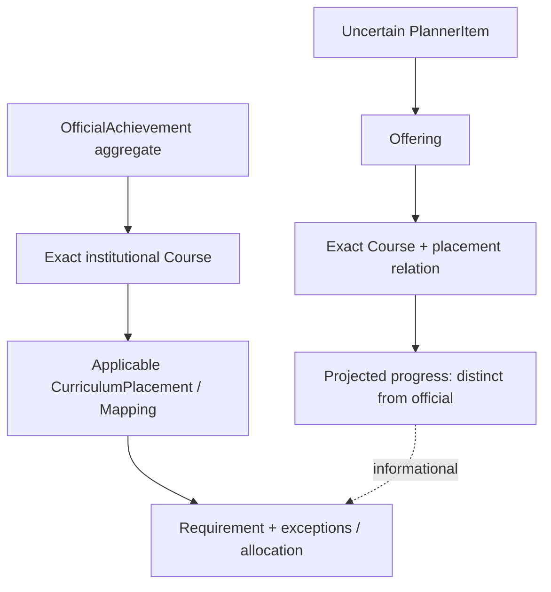

# Planner CurriculumCourse中心モデル — architecture decision / v22 read foundation

監査日: 2026-10-02（Asia/Tokyo）。基準: `dev` **4938da08fea438ad0379db1fd33bce63d2dc27c2**。branch: `feature/planner-curriculum-centered-model`。

**結論はB: 現行CurriculumCourseと将来のstable Course identityを責務・型として分ける必要がある。** 現行の321 IDsは2026の制度科目参照として維持する。新しいIDを今回発行しない。長期モデルの中心は制度上の同一科目であり、Offering、PlannerItem、公式aggregate、課程上の配置をその下で参照する。名称一致、開講年度の変更だけをidentity変更の根拠にしない。

今回実装するのは既存v22 identity上のpure `deriveCurriculumCourseView`とcharacterization testsだけ。永続schema、既存UI、卒業計算、catalog bytes、migrationは変更しない。`schemaVersion=22`、`graduationCheckComplete=false`を維持する。長期モデルの保存・multi-year registryはこのPRの完了条件ではなく、後続の明示的なmigration工程である。

この決定は、旧基準SHAの[planner-multi-year-design.md](planner-multi-year-design.md)にある「209 legacy Courseをregistryの中心にする」「将来schema v22」の提案を更新する。現在のv22は独立curriculum import identityを保存する実装済みschemaである。旧文書の型・migrationをそのまま採用しない。旧文書のannual revision pin、進捗owner維持、課程と開講年度の分離は継承する。[planner-curriculum-course-foundation.md](planner-curriculum-course-foundation.md)の2026 source/identity方針も維持するが、「年度非依存ID文字列」と「年度横断の制度同一性が保証されたidentity」は区別する。

## 1. Current state — 調査範囲と再現可能な事実

repoのファイル一覧、`src/planner`全体のidentity/reference検索、`src/pages/PlannerPage.tsx`の集計・保存経路、planner components、JSON/Schema、generation script/input ledger、既存docs/tests、extensionとCIを監査した。型・schema・生成データ・生成scriptを別々に確認した。外部公式資料の再検証・新年度source収集は行っていない。

| 基準devの事実 | 数値 / 根拠 |
| --- | --- |
| Annual Offerings / Mappings / provisional legacy Courses | 686 / 502 / 209。`src/data/planner_catalog_2026.json` |
| legacy `courseId`あり / null | 338 / 348。全209 Courseの`identityStatus=provisional` |
| runtime resolution | matched 648 / manual_review 8 / outside_mapping_scope 30。`manualMappingOverrides.ts`のmanual/official ledger適用後 |
| CurriculumCourses | 321。87 explicit equivalence groups + 234 singletons。`scripts/inputs/curriculum-equivalences-2026.json` / `curriculumGeneration.ts` |
| Offering → CurriculumCourse | unique 616 / ambiguous 32 / unmatched 38。generated `offeringRelations` |
| 年度relation候補が一つもないCurriculumCourse | 36。開講のない科目もmasterには存在する |
| 同じcanonicalNameを持つ複数identity | 10名称。名称でgroupすると既存分離を破壊する |
| legacy crosswalk | 現データでは209/209がexact。これは616 unique relationsのうちlegacy IDがある範囲の一致であり、321制度科目全体のcoverageや年度横断保証ではない |
| Annual型 / master source | `Offering.academicYear` / `PlannerCatalog.academicYear`はliteral 2026、CurriculumCatalog.sourceも`official_curriculum_mappings_2026`固定 |
| Planner attemptの保存キー | `offeringId`。v22は一Offeringにつき一PlannerItem。通信とschoolingを別々に保存可能。同じOfferingへの複数回attemptは未対応 |
| CourseProgress | `curriculumCourseProgress.ts`のpure derived state。公式aggregateとattempt contributionを別々に集計。卒業allocatorではない |
| import | Stage Aの制度identityとStage Bの開講照合を独立保存。componentは`sourceCourseId`で親official rowに所属 |
| 卒業・区分集計 | `deriveImportedAchievements`で計算専用virtual Offering/PlannerItemへ変換し、既存2026 engineへ渡す |
| storage | v22までのmigration、validation、optimistic raw比較、recovery backup、認定shadow。loadが新しいViewを保存することはない |

生成経路は `scripts/inputs/curriculum-rows-2026.json` + explicit equivalences → `generateCurriculumCatalog` → `planner_curriculum_2026.json` → `attachCurriculumCatalog`である。生成前に既存manual/official mapping overridesを適用する。`npm run catalog:check`はbuildで実行される。

original Mapping/Offering/legacy Course UUIDの発行器、`contract.py`、元catalog builder、元manifest本体はrepoに存在しない。入力ledgerには元curriculum sourceとmanifestのSHA-256があり、旧監査文書にも一致する記録がある。**元UUID生成アルゴリズムや2027での再発行有無は、このrepoから証明できない。** 存在しないscriptを推測して「安定」と認定しない。checked-in CurriculumCourse generatorについては下記のとおり追跡・テストできる。

## 2. Problems — 長期運用上の問題

1. CurriculumCourseが制度identity、2026 mapping membership、scope、単一構成単位を同時に持つ。singleton IDもmapping UUIDに依存する。課程配置の変化をidentity変更として扱いかねない。
2. equivalenceを作る`definition(row)`はcanonicalName / category / curriculumCredits / schoolingOnly / mediaOnlyの一致を要求する。同じ制度科目でも課程ごとにcategoryや単位が違えば現generatorでは同groupにできない。現modelでは「制度上別科目」と「配置上別定義」を表現上区別できない。
3. 年度Offeringがなくてもofficial factは存在するが、卒業・区分・指導資格単位のlegacy adapterにはOfferingやlegacy courseIdが必要な箇所が残る。CurriculumCourse exactだけではすべての算入を保証できない。
4. 現Unified Viewはlegacy courseIdで1対1の場合だけPlannerとofficialをcoalesceする。制度Course identityを中心に全attemptと公式行を常に別childとして扱うcontractが必要。
5. catalog singleton・686件検査・Schemaの2026固定により、2027 bundleを単純追加できない。current catalog置換は過去のPlannerItem・todos・progress・evaluationを参照不正にする。
6. import年度にはsource / inferred / manual / unknownがある。取得日・capture日からの推定を公式の履修年度や開講の証拠に昇格させられない。課程適用はさらに別軸である。
7. repeatableや史学の修得順・配分先と制度identityを混ぜると、Course completionの汎用capが卒業算入の事実を消す。現CourseProgressのuncapped totalsを維持する。

## 3. Domain entities — 最終的な責務と境界



- **Stable Institutional Course**: 制度上同一の科目のidentity。名称履歴・同一性evidenceを持てる。年度・必修区分・適用課程の単位はownerにしない。将来の型名は`InstitutionalCourse`等でlegacy `Course`と区別する。
- **現CurriculumCourse**: 2026公式row群への既存の保守的な参照。今回のView groupingの正本。将来はstable identityへのcrosswalkを持つcompatibility projectionとして残す。旧321 IDを捨てない。
- **CurriculumPlacement**: stable Courseの適用課程・scope内の配置。category / field / requirementType / curriculumCredits / eligibility / method restrictions / sourceをownerにする。現Mappingが主要な配置情報を既に持つ。
- **CurriculumVersion**: 適用課程とrule/source revisionのbundle。annual opening yearとは独立。大学資料が確認できたversionだけを収録し、2027/2028の制度を架空生成しない。
- **Offering**: 特定年度の方式・クラス・期・開講単位等。制度identityとのrelationはexplicit、複数候補・未確定を許容する。teacher等は現型にないのでsourceが得られるまで補完しない。
- **PlannerItem**: 一Offeringを選択したlearner attempt。status / plannedYear / plannedTerm / studyYear / earnedOrder / explicit credit contribution / optional import source linkを持つ。Course単位に潰さない。
- **ImportedCourseAchievement**: 一公式科目rowのaggregate。annual openingが未特定でも制度identityを持てる。公式aggregateの年度はそのsourceに記録された文脈であり、全componentがその年度だったとは断定しない。
- **ImportedStudyRecord**: 親official rowのcomponent/detail。年度・方式・日付・評価・raw slotを保つ。独立したofficial earned aggregateではない。親が不明のlegacy/orphanも保持する。
- **CourseProgress / CourseView**: identityが確定したchildを集めるpure projection。completionとgraduation allocationを分ける。結果を永続化しない。

将来のcourse-level plan intentは「開講未確認の希望」としてstable Courseを参照する別entityにできる。今回は既存PlannerItemのofferingIdをnullable化せず、intentの保存やstatusも追加しない。

## 4. Identity rules — 安定性監査とBの理由

### 4.1 現generatorの実際のID規則

| 対象 | ID / relationの生成 | 安定性の範囲 |
| --- | --- | --- |
| singleton CurriculumCourse | `curriculum:${row.mappingId}` (`curriculumGeneration.ts`) | mapping UUIDを維持すれば安定。再発行すれば同名・同コードでも変わる |
| explicit group | `group.id`をledgerからそのまま採用。現ledgerの値も`curriculum:<UUID>`だが、メンバーのsort/hashからruntime再計算しない | ledger IDをpinすれば順序・scope追加でIDを変えなくてよい。ただし現在のequivalence validation/definition制約は残る |
| mapping → Course | 全502 mappingsを一つずつrow groupへ割当。coverage/duplicate/definition/evidenceを検査 | 一mappingは現masterで一Course。複数versionのplacementを同時に扱う契約ではない |
| OfferingRelations | 独自relation IDなし。`offeringId`がkey。matched offeringのmappingIdsをCourse IDsへ引いてsort/dedup。候補1件だけならexact、2件以上はnull、unmatchedは空 | Offeringの名前・subjectCode・年度からCourseを発行しない。mapping edge/row groupingの変更で候補は変わる |
| legacyCourseRelations | legacy courseIdの全member Offeringがexactかつ同一Courseの場合だけexact crosswalk | member subsetやannual catalog更新により結論が変わり得る。永久equivalenceの証明ではない |
| Offering ID / legacy Course UUID / Mapping UUID | committed snapshotを保持。overrideはIDを変えない。元発行器不在 | UUID v4形式であることはschemaで確認できるが、minting algorithm・cross-year continuityは不明 |

CurriculumCourse IDの文字列には年度・canonicalName・subjectCodeは入らない。ただしsingletonは年度sourceのmapping行に間接依存し、groupの検証証拠も2026 offering IDsに依存する。`generate-curriculum-catalog.mts`は2026 input/output pathを固定し、`attachCurriculumCatalog`は全mappingと全annual relationのcoverageを要求する。**2027 catalogを新mapping IDsで生成すれば234 singletonのIDが変わる可能性がある。** これは年度そのものから変わるのではなくsource row identityを引き継ぐ契約がないためである。

新characterization testは、(a) mappingとpinned groupを保ちannual year/Offering IDsのみ変えればCourse IDsが同じ、(b) singleton mappingを再発行すれば同じ名称・subjectCodeでもCourse IDが変わる、を拘束する。前者はsynthetic generator probeであり、公式2027 catalogやruntime対応を意味しない。

`subjectCode`はOfferingのmetadataに留まる。経済学の通信と冬期schoolingは両方`ECN100TA`で、Offering creditsは4と2、classCodeはnullと40005。Course IDは`curriculum:5dc7b1c5-9798-4d15-9528-1a42e2b29ddd`。コード一致はdelivery variationの手掛かりにはなるが、全科目の制度unique keyや改制後の同一性を証明しない。

### 4.2 同名別identityを安全に扱う根拠・限界

「日本史概説」は現masterで二つを保持する。

| CurriculumCourse | 定義 / mapping |
| --- | --- |
| `curriculum:c644b305-f312-4b08-8f8f-aaf02cf9069e` | 2単位、史学scope、singleton mapping `c644b305-…` |
| `curriculum:db2833b3-2a18-4059-85e7-beeaae2d3107` | 4単位、史学と地理scope、explicit group `db2833b3-…` / `f87aca70-…` |

双方を指すannual Offeringは候補2件のrelationを保持し、`curriculumCourseId=null`となる。例: Offering `2c368dad-a33c-4cbc-8a15-295a82cf36e2`。Stage Aは公式compositionCredits=4などのsource条件で4単位側を絞れるが、名前しかなければambiguousである。progress/Viewはexact IDsでのみgroupし、同名でfallbackしない。既存`curriculum-foundation.test.mjs`、`course-progress.test.mjs`と新View testがこれを拘束する。

この分離は誤統合を避ける保守的なsource-row identityであり、**2単位と4単位が制度上必ず別科目だと新たに認定したものではない。** 将来公式evidenceが同一制度科目の異なるplacementと証明すれば、stable Courseへのcrosswalkを検討する。証拠がない今は別ID・候補・公式事実を保持する。史学演習1〜4、歴史資料学1〜6やtheme/numberも汎用のsuffix除去で統合しない。修得順による卒業配分はidentity確定とは別である。

### 4.3 A / B / Cの比較と決定

- **Aは不採用**: 現ID文字列を凍結するだけでは、category/creditsが異なる同一制度科目やsingleton mapping再発行を安全に扱えない。stable制度identityの保証がない。
- **Bを採用**: stable Courseと2026 row-group参照を分け、CurriculumPlacementで配置差分を表現する。既存IDsをcompatibility aliasとして維持すれば、全IDを今すぐ再発行する必要はない。stable IDとして既存`curriculum:*`を採用できるものもあるが、一意のcrosswalk/evidence確認後に限定する。
- **Cだけでは不足**: 将来placementを足す「責務説明」だけで現generatorをmasterとして毎年複製すると、composition/categoryによる分離を既にidentity判定へ持ち込む。独立stable identityの型・crosswalk境界を設計段階で確定する必要がある。

legacy `Course`よりCurriculumCourseの方が制度row coverage・公式名称・配置証拠に優れる。しかしlegacyの209 provisional IDsも、現CurriculumCourseの321 source-row IDsも、そのまま年度横断verified identityとは呼べない。現CurriculumCourseを**当面の2026 View identity**として継続し、長期stable masterとは区別する。

stable identity確定には公式の制度科目ID、改制・同一扱い・名称変更の根拠、source lineage、監査済みequivalence ledgerが必要。名前・scope・credits・subjectCodeは候補検出/矛盾検査に用い、いずれか一つで自動merge/splitしない。scopeや必修/選択が変わっても同一制度科目ならstable Courseは維持しplacementを増やす。制度上別科目・統合/分割なら明示crosswalkと互換migrationを要する。

## 5. Source-of-truth table — field/stateのowner

| field/state | 正本owner / 現キー | 他entityの扱い・禁止 |
| --- | --- | --- |
| 制度科目identity / canonicalName | 今回: CurriculumCourse.id / canonicalName。長期: stable InstitutionalCourse + name/evidence history | legacy Courseはcompatibility。名前から新IDを発行・既存IDを統合しない |
| curriculumCredits / 構成単位 | 現masterはsource rowsからの共有projection。source definitionはMapping/ledger。長期: applicable Placement | Offering.creditsで補完しない。version間で常に同じ値とはしない |
| scopeIds / mappingIds | 現CurriculumCourseは関係のindex。正本はofficial row placement / mapping ledger | selectedScopeIdはuser context。変更してCourse identityを書き換えない |
| academicYear / method / credits / codes / period / delivery / annual eligibility / source | Offering / offeringId。teacherは現型なし | curriculum/year-independent ownerへ移動しない。future Offeringに前年値をコピーして確定しない |
| status / plannedYear / plannedTerm / studyYear / earnedOrder | PlannerItem / offeringId | progress/evaluationからstatusを自動生成しない。plannedYearは希望暦年、Offering.academicYearや課程versionではない |
| courseCreditContribution | PlannerItemの明示learner metadata。なしはOffering.credits fallback | 公式単位、残単位、他attemptや評価から推定しない。schooling registration credits / graduation capを書き換えない |
| importedSourceCourseId | PlannerItemのoptional source association | 同じCourse IDだけを根拠にsource linkを捏造しない |
| earnedCreditsTotal / schoolingCreditsTotal / compositionCredits / exemption / additionalEnrollment / rawName / categoryRaw / capturedAt | ImportedCourseAchievement / immutable source row id | earnedCreditsTotalが公式修得aggregateの唯一の正本。component合算・Planner earnedを公式値へ書き込まない。compositionCreditsはその公式rowの事実でmasterを変更しない |
| curriculumCourseId / curriculumMatch / candidates | ImportedCourseAchievementの保存済み照合結果。公式source事実とは別のassociation | independent Stage Aを維持。annual selection未特定でもexactを失わない。矛盾はreview/unresolved |
| selectedOfferingId / offeringMatch / selectionSource / candidates | ImportedCourseAchievementのoptional annual association | Course identityの存在にannual associationを必須にしない |
| sourceCourseId / method / academicYear / raw slot / date / credits / grade / reports / examGrade | ImportedStudyRecord / component id。sourceCourseIdが親relation | componentはdetail。年度違いをcurrent Offeringへ変換しない。正本official rowがある場合、optional aggregate copiesはlegacy輸送互換で読まない |
| category / field / requirementType / eligibility / schoolingOnly / mediaOnly / source | Mapping / mappingId。長期: CurriculumPlacement / version + scope | Offering.mappingIdsはannual relation。Course identityをcategoryやrequirementへ従属させない |
| target / conditions / value / ruleType / scope / unsupported status | Requirement + 課程policy/source bundle | rule target名称は対象候補の記述。identity keyとして使わない。unsupportedはunknownを保持 |
| correspondenceProgress | learner attempt activity / offeringId → requiredReports, reports, examGrade | official detailとは別。必要reports policyは2026 Offering source。科目全体へ移し替えない。削除後も保存/Undo可能 |
| mediaSchoolingProgress | learner attempt activity / offeringId → lessons, assessments | componentの修得や評価から動画進捗を作らない。過去official rowだけではtrackingを作らない |
| courseEvaluations | learner evaluation / offeringId → finalGrade, reportGrade, schoolingGrade | 公式source gradeを上書きしない。status/official earnedへ自動反映しない |
| ImportedCourseUserMeta | user context / imported achievement id → lifecycleStatus, plannedYear/Term, studyYear | source rowの公式事実・年度・identityを変更しない。attemptへ公式行を吸収する用途にしない |
| annual limit state | `annualCreditLimitReferences`等のderived result。registrationの入力はPlannerItem + Offering | aggregateを保存しない。通信source-linked earnedは公式値（null/0含む）を参照、schoolingはOffering登録単位。49等は適用年度policy。卒業配分とは別 |
| graduation profile / recognized credits | learner-entered GraduationProfile / applicability / admission context | 認定aggregate・内訳・免除の意味を保ち、公式importへ混ぜない。admissionYearやannual selectorから課程を推定しない |
| selectedScopeId / thesis / guidance | user state / scope別記録。legacy thesisSelectionはcompatibility | thesisProgressByScopeが正本。annual Offeringなしで存在。新catalog選択でリセットしない |
| public courses | PublicCourse / UUID → title, status, schedule, grades, credits=2 | catalog非依存の別記録。名称一致でCurriculumCourseへ寄せない。卒業上限は別allocator |
| todos | PlannerTodo / todo.id、offeringId optional | general todoはnull、annual todoはOffering参照。Courseへkey移動しない |
| Course earned/projected/completion/warnings | CourseProgress / CourseViewのpure derived state | persisted aggregateにしない。事実のuncapped subtotalとgraduation credit allocationを同一視しない |

同じ事実のキャッシュ/projectionは正本ではない。新コードは公式aggregate copiesから復元せず、全detailをparent IDだけでattachする。既存v10 migrationやlegacy計算fallbackで「保存済みrow aggregateのcopy」を復元する経路は互換処理として残り、component creditsを合算する許可ではない。

## 6. Data flow — 4フロー

### A. 成績表import



Stage Aの候補検索はcanonical source名/制約付きalias、categoryRaw、compositionCreditsを用いる。単一候補という照合結果は保存できるが、stable制度identityのcross-year verificationとは異なる。Stage Bは年度・方式の独立照合。official rowとdetailを先に保持し、exact Offeringがなくてもofficial creditsを保持する。candidateが複数ならfirst/current/latestを選ばない。

`gradeImportApply.ts`はschooling source年と通信推定年を保持し、historical componentsのautoPlanner生成を防ぐ。`sourceCourseFor`は複数componentがすべて同じsafe openingを指す場合だけwhole-row openingを自動選択する。`autoPlannerItemsForImport`は一対一のsource/Offering証拠かつ正の公式aggregateがある場合だけsource-linked earnedを生成する。componentsやpassing gradeだけでearnedにしない。multi-year接続前に、年度を考慮しない安全候補検査やcourse-only fallbackを再監査する。

現卒業adapterがvirtual Offeringを作るのは計算互換表現であり、過去recordを実在2026 Offeringへ保存し直すことではない。新Viewはこのadapterを呼ばない。

### B. 履修計画



Courseの検索/summaryからannual候補を提示しても、追加のownerはOfferingとPlannerItemである。同じCourseの通信・winter schooling・次年度classは別attempt。v22の将来plannedYearは2026 Offeringを参考にする仮計画であり、2027の開講を作ったことにならない。annual source未確認のcourse-level intentは後続の別保存entityで扱う。

### C. Course progress



official4 + source-linked earned attempt → known earned4、childは両方保持。official4 +別manual earned2 → known earned6 / excess candidate2。公式とmanualの別記録を名前や汎用capで消さない。ただしこれは6単位の正式卒業算入を主張しない。nullはunknownとしてwarningsを残す。repeatableはcompletion=`repeatable`としordinary target cap/advisoryを適用しない。

### D. graduation



official earned inputsには既存のofficial-priority/dedupを維持する。exact official Courseがある場合、同Courseのmanual earnedも既存graduation inputから保守的に除外する。Course Viewのsource-linkのみのdedupと、graduationのCourse-wide official priorityは別policyである。未修得計画はprojected欄にだけ置く。requirement未解決/課程unknown/unsupportedはunknown、全cardの成立でも卒業可否を判定しない。

## 7. Multi-year strategy — annual masterとidentityを独立させる

- `planner_catalog_2026.json`は凍結snapshotとして保持し、2027追加時に上書きしない。source revisionとraw/override digestをmanifestで識別する。Offering IDsは年度ごとに別identity、同じclass/subject codeでも再利用しない。
- **Offeringに年度横断同一IDは不要だが、同年度実体のIDと保存済み参照の解決は安定が必要。** annual修正は新revisionとし、過去記録がpinしたrevisionを失わない。最新credits/mappingで過去attemptの意味を書き換えない。
- `planner_curriculum_2026.json`は現2026 source projectionとして保存する。2027開講追加のために毎年321 Course IDsを複製・再発行しない。将来はstable masterとversion別placement、annual relationを分離する。課程の公式変更がないのに`curriculum_2027`を作らない。
- 年度別registryは必要になるが今回は実装しない。raw 2026の686件検査、2026 override適用は2026 adapter内に置く。registry全体の件数へそのまま適用しない。
- current catalogを履歴catalogの代わりに使わない。必要な年/revisionが未取得ならmissing referenceを保持し、review/read-only recoveryとする。削除/Undo後に残るevaluation/progress/todoにもrevision pinを解決できる必要がある。
- historical official recordはannual参照なしで制度Courseへattachできる。componentにsource yearがあればその年だけを照合し、current年へ変換しない。年不明/推定の場合も自動でcurrent/latestを選ばない。

必要なboundary（設計のみ、実データなし）:

```ts
// 新しい長期モデルの概念型。現2026 Offering/PlannerStateへの追加ではない。
type OfferingRef = { offeringId: string; academicYear: number; catalogRevision: string };
type AnnualCatalogDescriptor = {
  academicYear: number;
  revision: string;
  sourceDigests: string[];
  coverage: 'partial' | 'verified_for_declared_scope';
};
interface AnnualCatalogRegistry {
  list(): readonly AnnualCatalogDescriptor[];
  resolve(ref: OfferingRef): OfferingResolution; // exact / unavailable / conflicting
  candidates(query: AnnualOfferingQuery): readonly AnnualOfferingCandidate[];
}
```

`OfferingResolution`/`AnnualOfferingQuery`/candidateは将来resolverの契約名で、未実装。resolveはrefで指定されたsnapshotだけを返し、latestへのfallbackをしない。candidatesは制度ID +対象開講年 +方式/クラス証拠で検索する。一候補でもsource coverage不足なら自動linkしない。課程への適用bridge検証は別boundaryに置く。

## 8. Curriculum version strategy — identityとplacement

例として同一制度科目「経済学」の必修/選択、category、graduation role、curriculumCreditsが課程によって変わる場合、**stable Courseを分割せず、別placementとして表す**。異なる単位数が制度上別科目を意味するかはsourceの判断であり、数字だけで決めない。2026に今あるMapping/Requirementと原典rowを互換adapterで参照する。将来sourceが複数課程を証明して初めて別CurriculumVersionを収録する。

```ts
// 設計上の型: 永続化しない。制度根拠とID ledgerが確定してから実装する。
type InstitutionalCourse = {
  id: string;
  canonicalName: string;
  identityStatus: 'source_row_only' | 'institutionally_verified';
  evidenceIds: string[];
};
type CurriculumVersion = {
  id: string;
  sourceRevision: string;
  evidenceIds: string[]; // 単なる開講年度ではなく適用課程の根拠
};
type CurriculumPlacement = {
  id: string;
  institutionalCourseId: string;
  curriculumVersionId: string;
  mappingId: string; // legacy 2026 mappingへのsource crosswalk
  scopeId: string;
  category: string;
  field: string | null;
  requirementType: string | null;
  curriculumCredits: number | null;
  eligibleYears: number[] | null;
  schoolingOnly: boolean;
  mediaOnly: boolean;
  evidenceIds: string[];
};
```

2026の現CurriculumCourseからstable Courseへのcrosswalkはexact / ambiguous / unverifiedを許容する。不要なID再発行を避けるため、検証済み1対1なら既存`curriculum:*`文字列をstable IDとしてpinする選択も可能。複数row groupが同一stable Courseと確認された場合も旧IDを残してexplicit aliasを付ける。Course registryへlegacy209をそのまま正本として採用しない。

卒業profileの`current_2026 | legacy_or_transition | unknown`を、入学年やannual catalogから新versionへ自動変換しない。適用課程未確認は今後もunknown。構成単位を含むcompletion targetは将来`Course + applicable Placement/context`から導出する。現Viewは2026 masterの単一targetを使うcompatibility contractであり、複数version対応を装わない。

## 9. Migration strategy — 今回不要、保存の拡張時にはv23が必要

**今回v23は不要。** Viewは既存v22に既にあるフィールドを読み、既存IDsのexact relationだけでgroupする。新persistent ID/version/placementは直ちに必要ではないため、コードとして追加しない。

後続でstable Course association、selected curriculum version、revision付きOfferingRef、course-level future intent、または同Offering複数attemptを保存するなら**新しい永続契約が必要**。現schemaは2026 Offering参照とone-per-offeringを前提にしており、v22 fieldsを別の意味に変えて済ませない。schema v23（またはその時点の次version）の明示migrationを要する。catalog masterの分離だけが静的data変更で、利用者の保存値が一切変わらない段階なら、state versionを上げる理由にはならない。

roll-out案:

1. 2026 bytes・ID・manual/source ledgerを凍結し、stable registry/crosswalkと2026 placement adapterを静的dataとして監査する。原発行器を入手できなければevidence付き明示ledgerを新たな正本にする。unverified relationsは保持する。
2. read-only shadow projectionで旧CurriculumCourse Viewと新stable Viewの事実保持・ambiguity・特例を比較する。名称mergeや最新revision fallbackを行わない。UI・計算結果が変わる前に差分をreviewできるようにする。
3. 保存変更が必要になった時だけ独立schema/migrationを実装する。v22のitems/official IDs/fingerprints/raw/components/manual selection/progress/evaluation/meta/public/todos/profile/thesisと順序を保持する。旧curriculumCourseIdは互換参照として残し、stable referenceをexact crosswalkで補完する。曖昧の場合は補完しない。
4. 既存annual参照を2026 frozen descriptor/revisionへpinする。active PlannerItemと、削除後の残存progress/evaluation/todoの参照を網羅する。refが解決不能でもsource factを削除しない。ref indexを正本bindingと二重保存しない。
5. curriculum選択は明示user/source根拠だけで追加。`unknown`/旧課程はそのまま保持する。v22 loadのread-only、raw比較、backup/shadow、future-schema lockを継承し、migration時自動saveをしない。
6. 新clientを展開し、旧v22 clientがv23を変更lockすることを検証する。downgrade保存は禁止。新schemaのsave失敗・別tab競合・Undo/re-addを検証してからfuture-plan CRUD / annual registryを段階公開する。
7. 公式2027 sourceとcross-year evidenceが揃ってから別annual bundleを追加。requirement bridge・import・special rulesが未対応のままglobal multi-year offeringsを旧matcherへ渡さない。

複数回attemptを同一Offeringへ保存する時は独立attempt IDとprogress/evaluationの参照方針が必要になる。現v22のoffering-keyed ownerを今回移動しない。一般のcourse-level plan intent、annual registry、placement保存は最小View PRに含めない。

## 10. Unified View target model — 今回のpure foundation

`src/planner/curriculumCourseView.ts`に`deriveCurriculumCourseView(state, catalog)`を追加する。既存`deriveCurriculumCourseProgress`の集計・completion・repeatability・warningを再利用し、新たな単位policyを作らない。`PlannerPage`からはまだ呼ばない。

```ts
CurriculumCourseViewResult {
  courses: CurriculumCourseView[];
  unresolved: (
    | { kind: 'official'; official: OfficialAchievementView; reason: string }
    | { kind: 'attempt'; attempt: PlannerAttemptView; reason: string }
  )[];
  orphanStudyRecords: ImportedStudyRecord[];
}

CurriculumCourseView {
  curriculumCourse;                 // exact 2026 master identity
  officialAchievements: [{
    achievement,                    // official row object, including null/0
    studyRecords,                   // parent sourceCourseId relation only
    userMeta,                       // learner context only
    displayStatus
  }];
  attempts: [{
    plannerItem,
    offering,
    progress: { correspondence, mediaSchooling }, // saved data or null
    evaluation,                     // saved data or null
    earnedContribution,
    projectedContribution,
    officialEarnedPreferred
  }];
  earnedCredits; projectedCredits; remainingCredits;
  completion; projectedCompletion; repeatable;
  earnedExcessCredits; projectedExcessCredits;
  warnings;
}
```

contract:

- official rowはattemptの数に関係なく独立childとして必ず列挙する。1対1でもattemptに吸収しない。annual/legacy Courseがないexact officialもCourse Viewへ出る。
- `exactImportedCurriculumId`の既存validationを満たすidentityだけをgroupする。name fallbackやlegacy repairから新identityを推定しない。
- ambiguous/unmatched/contradictory officialは`unresolved`に**source rowそのもの**、候補、meta、detailを保持する。warningだけに変換して内容を失わない。
- exactなOffering.curriculumCourseIdを持つ各PlannerItemを別attemptで列挙する。同Courseの通信とschoolingは2件。未一致・missing Offeringもfull PlannerItem + nullable Offering + saved progress/evaluationをunresolvedに保持する。
- detailはsourceCourseIdだけで親を決める。未一致Offeringやhistorical yearでも親detailに残す。parent欠落/IDなしはorphanStudyRecordsに列挙し、同名parentに自動attachしない。
- saved progress/evaluationはOffering IDでjoinする。defaults・条件達成・imported rowからattempt activityを生成しない。nullを「未修得」と断定しない。effective report requirement等は後続UIが既存helperを使って表示する。
- Course earned/projectedはknown uncapped subtotal。official4 +独立manual2を6として保持することと、official priorityで正式算入4に留めることは両立する。
- resultは関連childがあるCourseだけを列挙する。未履修master全件の検索は別selector。selectedScopeはrepeatability contextであり、official rowのvisibilityをscopeで削除しない。
- public courses / thesis / recognized profile / general todosはこのprojectionに混ぜず、独立surfaceで保持する。attempt削除後のprogress/evaluationもstateに残るが、active attemptのないそれらを新Course attemptとして列挙しない。
- input state/catalogをmutationしない。output containersは新規、source objectsはborrowed referencesでありconsumerはread-onlyとして扱う。outputを編集・保存するAPIにしない。

今回の15 testsは要求された10ケースをすべて含み、component100でもofficialが変わらないnull/0/4、矛盾source link、full unresolved attempt、saved field ownership、deep-frozen mutation禁止、generation identity driftも検証する。既存testsは削除・弱体化しない。

## 11. Graduation integration — Offering依存監査と移行分類

分類: **KEEP**=Offering/attempt ownerとして適正、**MIGRATE**=制度Course/placement入力へ変えるべき、**DERIVED**=presentation grouping、**DEFER**=multi-year/migration後。以下は後続の分類であり、このPRで列挙箇所の実装を変えたという意味ではない。

| 箇所 / symbol | 分類 | 現依存・具体的な次の境界 |
| --- | --- | --- |
| `unifiedCourseView.ts:createUnifiedCourseRows`, `safePlannerCourseId` | DERIVED | legacy courseIdで1対1 coalescing。新Course Viewではofficial childとattempt childを分ける。旧row APIは今回保持 |
| `importedAchievementIdentity.ts:resolveSafeImportedCourseId` | MIGRATE | manual opening確認、legacy Course存在、normalized base-name / candidatesでlegacy identity推定。制度groupingでは使わず保存済みexact curriculum identityを優先。legacy経路は移行まで保持 |
| `curriculumCourseProgress.ts:deriveCurriculumCourseProgress` | DERIVED | exact Course IDsでgroup。uncapped、source-linked earnedのみdedup。長期targetはplacement contextへ。現挙動は再利用 |
| `curriculumCourseProgress.ts:isRepeatableCourse` | DEFER | requirementsのcourse_name、scope、Offering名を特例判定に使用。identityが確定した後のrule分類でありname mergeではない。version別policyへ移行 |
| `officialCourseCredits.ts:plannerItemsWithoutOfficialEarned` | KEEP | 公式Course優先とsource-linkの保守的dedupは維持。stable/placementへのcrosswalk確定後に参照adapterだけ変更 |
| `curriculumIdentityValidation.ts:validImportedCurriculumIdentity` | DEFER | current catalogにcandidate/selectedOfferingが存在する前提。exact openingがmissingなら全extension invalidとなる。registry-aware annual検証と制度検証を分ける際も矛盾をreviewに残す |
| `gradeImportApply.ts:sourceCourseFor`, Stage A/Stage B | KEEP | official parent/detail保存、optional annual association、historical auto-item guardを維持 |
| `gradeImportApply.ts:autoPlannerOfferingIdForImport`, `autoPlannerItemsForImport` | DEFER | 年度未filterの全候補一意性検査、courseOnly guard、legacy courseId必須が残る。annual registry導入前に対象年/source coverageで候補母集団を明確化 |
| `importedAchievementCalculations.ts:deriveImportedAchievements` | MIGRATE | linked/template Offering、legacy courseId、`matchedNameOfferings`、virtual annualYear2026に依存。制度identity+applicable mappingsからOfficialCreditEvidenceを直接作る方向。旧adapterを今回維持 |
| 同file `mediaOfferingFor`, `derivedMediaOffering`, `managedImportedMedia` | DEFER | legacy Courseとterm/name repairからcurrent Media候補を選ぶ。歴史sourceのannual associationとは別に、current trackingを明示確認した場合だけ有効化。multi-year年/revision境界を追加する必要 |
| `graduationProgress.ts:calculateGraduationProgress` | MIGRATE | import virtual items + plannerItems + recognized Offeringをまとめる。公式入力をCourse→placement、計画入力をattempt→Offering→Course/placementとして分離するadapterが必要 |
| 同 `evaluateStructured`（基準L186–） | MIGRATE | requirement.target名からOffering.name一致でtargetMappingIdsを作る。開講なしCourseのrequired/min_courses対象が見つからない。placement target resolutionへ |
| 同 `groupedCards`（L300–） | MIGRATE | mappingId単位完成、Offering.credits/methodで言語/一般/体育集計。基礎特講、体育、自然科目familyを名前で分類。制度identityとpolicy targetを分離 |
| 同 `professionalCards`（L584–） | MIGRATE | Offering.method/credits/mappingId、legacy canonicalName、department×name repeatable、史学overview/sources、卒論name除外、地理配分。version固有policyを維持したCourse/placement evidence adapterへ |
| 同 law schooling（L936–） | MIGRATE | legacy canonicalName/Offering.nameで2026＊印対象と公開科目を除外。単なる全Course合算へ置換不可 |
| 同 `countedSchoolingCredits`（L1072–） | MIGRATE | 一mappingかつlegacy courseId必須、Offering.method、repeatable guard。公式S aggregateとcomponent証拠を別入力にし、partial attendance reference/requirement配分を分離 |
| 同 recognized inputs（L1208–） | MIGRATE | recognized Offering/legacy Course keyで重複抑制。公式achievement/認定factのsource lineageを保持し、同じcreditを二重配分しない |
| `annualPlan.ts:groupAnnualPlan`, delivery/term | KEEP | learner予定暦年とOffering deliveryごとのgroupはattempt ownerが正しい |
| 同 `annualCreditLimitReferences` | KEEP | 通信contributionとschooling登録単位を分け、linked earnedの公式null/0も保持。後続年ごとのpolicy/source確認はDEFER |
| 同 `createCreditClassifier`, `summarizeCategories` | MIGRATE | Offering.mappingIdsをscopeで分類、import virtual category overridesを注入。公式分類はCourse placementに基づく別inputへ。raw categoryはsource事実として保持 |
| `calculations.ts:summarizeCredits` | KEEP | attempt summary。公式aggregateを内部で増やす関数にしない。全体公式summaryとの統合selectorは別derived境界 |
| `calculations.ts:searchOfferings` | KEEP | name/code検索はannual候補の検索。identity mergeをしない |
| `CourseSearch.tsx` | KEEP | Offering候補単位の追加・eligibility・既存追加ID判定は保持。Course親からannual候補を見せるpresentationはDERIVED |
| `PlannedCourseList.tsx` | DERIVED | Offering単位編集・削除・schedule・evaluationはKEEP。new Course parent配下にofficial childを常時表示する最小UI sliceへ |
| `CurriculumCourseProgress.tsx` | DERIVED | 既にCourse summary +別attemptのcontribution編集。新View summary再利用可。graduation allocation UIにはしない |
| `plannerExport.ts:plannerExportPresentation`, `PlannerExportActions.tsx` | DERIVED | 現exportはactive PlannerItem/publicのみ。次のCourse exportではofficial/unresolved/orphanのrow typeを追加、attempt activity編集・credits意味は保持。annual source/ref表示はDEFER |
| `correspondenceProgress.ts`, `correspondenceRequirements.ts`, `CorrespondenceProgress.tsx` | KEEP | progress OfferingキーとrequiredReports source ledgerを維持。future yearに2026 policyをcopyしない。複数attempt/revisionの保存はDEFER |
| `mediaSchooling.ts`, `MediaSchoolingProgress.tsx`, share | KEEP | learner progress ownerはannual Offering。shareの年度group、source-only historical/current tracking分離はDEFER |
| `courseEvaluations.ts`, `CourseEvaluations.tsx` | KEEP | Offering-keyed learner grades、status非自動更新、削除後保持 |
| `storage.ts`, `validation.ts`, `curriculumMigration.ts`, generated Schema | DEFER | 全items/todos/progress/evaluation/current master refsを単年catalogで検証。schema22とfuture lockは維持。annual registry・stable/placement保存時のmigrationに限定 |
| `PlannerPage.tsx` | DERIVED | singleton catalogで旧Unified/summary/import/graduationを別derive。新Viewへの接続は後続UI slice。保存patchのownerを維持 |
| `thesisGuidance.ts:guidanceEligibilityCredits` | MIGRATE | Offering mappings/legacy Course＋imported resolver、composition ceilingに依存。Course/placement credit evidenceへ、thesis/guidanceのscope別user記録はKEEP |
| `graduationProfile.ts`, thesis/public/geography/history/repeatable/yearEligibility helpers | DEFER | 2026 source/制約とownerを凍結。特例をversion別policyに分ける段階で移す。scope/current年/入学年を混ぜない |
| `gradeImportContract.ts`, `directGradeHandoff.ts`, extension parser/bridge | KEEP | payload v1のsource事実とpreview-firstを維持。拡張はcatalog identityを生成しないのでこのViewにwire変更は不要 |
| home/QA/contact/member/shared Header/Footer/assets | KEEP | Planner domain identityを所有しない。今回変更対象なし |

将来の卒業inputは概念的に`OfficialCreditEvidence { sourceAchievementId, institutionalCourseRef, earnedCreditsTotal, schoolingCreditsTotal, compositionCredits, provenance }`と`ProjectedAttemptEvidence { attemptRef, offeringRef, courseRelation, plannedContribution }`を分け、`ApplicablePlacementResolver`へ渡す。これは設計案で、production型追加・engine置換は行わない。

graduation側ではofficial priorityを維持し、source row ID / revision / credit lineageで重複を確認する。CourseProgressのearned6をそのまま正式earned6として注入しない。official aggregateが複数rowの場合、sourceの独立性・duplicate snapshotはimportの保存契約で確認し、Course名から削除しない。repeatableの回数/単位上限、史学演習修得順、概説のschooling必修/選択配分、歴史資料学、地理transfer、法律partial2/＊印除外、一般自然family/基礎特講、外国語same-language/S条件、体育、卒論、公開科目、放送大学認定/編入免除をversion固有allocatorとして残す。どれもcompletion=`complete`から汎用に確定できない。

公式exact Courseしかない実績も将来はOfferingなしでplacementへ進める設計が可能。ただしS/回数/修得順の証拠が不足した条件はunknownに留め、component creditsからofficial aggregateを作って補完しない。`graduationCheckComplete=false`は引き続き全経路で保持する。

## 12. Risks / unresolved questions

| 未解決 / 制約 | 必要な根拠・対処 / blocking段階 |
| --- | --- |
| 制度上stable identifierの公式根拠 | 元generator/manifest・大学の科目ID/改制対照表が未収録。source-backed crosswalkの監査責任/evidence基準を確定する。今回read Viewはblockしないが年度横断verified identityの公開前に必要 |
| 同名2/4単位の史学identity | 現分離は安全なrow identity。制度同一か別placementかは未証明。現在の候補・旧IDsを保持。stable統合前に確認 |
| 同じ制度科目の構成単位が課程間で異なる場合のcompletion | applicable placementを要する。複数課程sourceが揃うまで現2026 target。履修完了と適用課程達成を分けるUI設計も後続 |
| Course-level official aggregateが複数回履修/複数年度を含む時のattempt attribution | aggregateを各attemptへ分配しない。source-linked一対一と別manual contributionを保持。repeatableやduplicate snapshotのsource lineageを監査してから正式allocatorへ |
| exact officialだがstored exact annual refが欠落/矛盾 | v22 validatorはextension全体をreject。new projectionではsourceをunresolvedとして保持。将来registry-aware validationでinstitutional validityとannual reviewを分離する必要 |
| 年不明 / inferred年 / course-only fallback | current Offeringを公式履修と同一視しない。multi-year matcher公開前にsource coverage・auto/manual条件を確定する |
| 既存Media派生はcurrent Offering metadataを利用 | historical displayとcurrent trackingを分け、年/revision保証なしのauto trackingを防ぐ。今回新Viewはsaved dataをjoinするだけでlegacy Media挙動を変更しない |
| 公式identity根拠とmanual-curated edge | existing ledger provenanceを保持。matchedというだけでPDF/制度同一性verifiedへ昇格しない |
| original snapshot発行器なし | checked-in raw/Schemaの再生成をしない。新静的master/crosswalkは別generatorでreviewする。原UUID生成の安定性を断言しない |
| future schema / orphan refs / old tabs | additive migration、revision pin、optimistic compare、recovery/lockを後続で検証。保存中断でもofficial/sourceを失わない |

今回のViewはv22のexactな**既存照合結果**を尊重するもので、institutional verificationの完成、multi-year support、卒業可否判定を意味しない。新source不足を架空データで埋めない。

## 13. Exact next implementation slice

**次PRはv22のまま、新Course Viewを履修・修得一覧の親/child表示にだけ接続する。** `PlannerPage`で新deriveを呼び、`PlannedCourseList`にCourse parent、独立official child + component detail、各Offering attempt child、unresolved/orphan sectionを追加する。既存のattempt編集・削除・Undo・progress/evaluation callbackはofferingId、official meta callbackはsource achievement idのまま使う。

acceptance criteria:

1. desktop/mobileの両方でOffering unknownのofficial行とunmatched historical detailを表示する。通信/schoolingの2attempt、same-name別identity、ambiguous/unmatched、orphanを取り落とさない。
2. official4 +source-linked earnedはCourse4、別manual2はCourse6/excess候補2として表示し、既存graduationのofficial-priority結果は不変。repeatableに汎用completion blockを追加しない。
3. existing component editorsのownership・extra reports保存・評価/status非連動・削除後progress保持・Undoを維持する。derived結果を保存patchとして渡さない。
4. public、thesis、recognized profileは独立surfaceのまま維持。年度検索・future仮計画・summary/annual/graduation policyの全面rewriteはしない。
5. View/browser presentationテストでlossless表示とowner routingを確認し、typecheck/lint/planner/extension/buildを実行する。schema22/falseとcatalog bytesを固定する。

その次にstatic stable identity/crosswalk + placement境界を監査し、保存変更が必要な段階で別v23 migration PRへ進む。annual registry追加とgraduation input adapter更新はさらに独立sliceとし、source/evidenceが揃うまでは未確定を保持する。

## Verification for this change

- 既存planner 362件 + 新規15件 = **377件pass**。要求10ケース、null/zero、source-link矛盾、deep freeze、generator ID driftを含む。
- Production追加はpure View moduleのみ。既存UI / graduation / storage / Schema / snapshotはdiffなし。
- `npm run typecheck` **pass**、`npm run lint` **pass**、`npm run test:planner` **377/377 pass**、`npm run test:extension` **19/19 pass**、`npm run build` **pass**（catalog:checkを含む）。Node v24.13.0、lockfile通りのnpm ciで検証。Viteの500 kB chunk size advisoryは残る。
- CIはmain向けpush/PRに限定されるため、このfeatureへの通常pushだけでCIが起動したとは報告しない。
