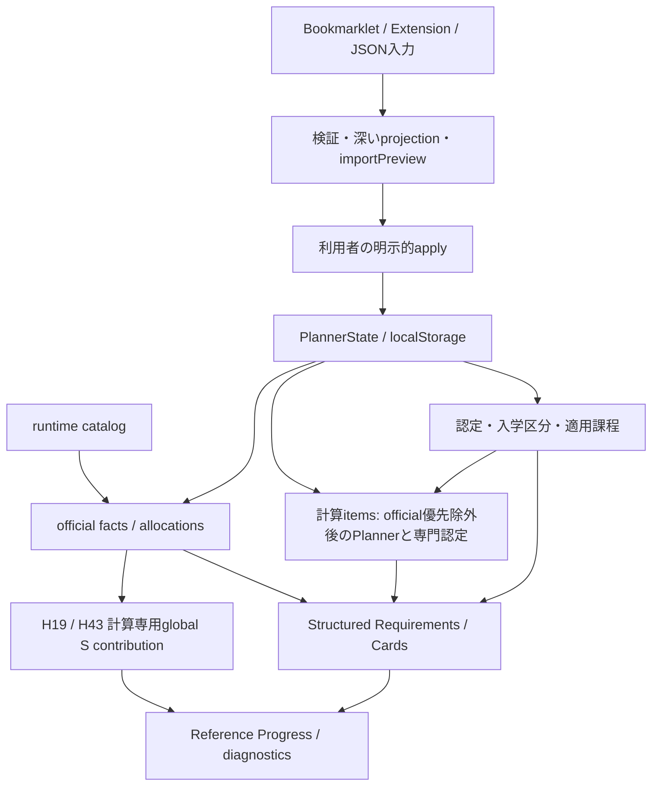

# 履修プランナー Architecture v1

## 1. Document Status

- 状態: 現行実装の Architecture v1（2026-10-08、Asia/Tokyo）。将来設計の確定書ではない。
- 基準: `origin/dev` の `1b14ff44f93ef665c0677d4d36b5077fa2cd8deb`（PR #87 `fix(planner): enforce grade import trust boundary` merge）。H41/H42 とその review follow-up を含む。H43の限定schooling経路はPR #88後の `6ab100abcc7d9cdc4b29ea0204b7799c8bd4c9ee` をbaseに追加。H19のLaw S30/S8分離はPR #91後の `7643130971246768624fe486a1fbb0d4d1cc8cd1` をbaseに追加。H14の専門認定overlap局所化は `dfb92b2c15aaccd7a3e86e7e466f2d9bbc51de79` をbaseに追加。
- `PlannerState.schemaVersion = 22`。catalog metadata の `graduationCheckComplete = false`、`sourceLinksReverified = false` を維持する。
- `graduationCheckComplete` は engine/catalog の開発上の完成度であり、個別学生の卒業可否ではない。個別の充足表示を合成して最終卒業判定を返すエンジンではない。
- 本書の「official」は取り込まれた成績表行の**計算上の authority**を指す。大学による署名・真正性を認証したデータという意味ではない。

前回 factual audit の F01–F13 を現行コードへ照合して反映した。F01 は merge 済み実装を正とし、F02–F13 は記述を修正した。文書完成と、未実装の卒業制度・全 H01–H66 の解消は別である。

## 2. Purpose / Scope

対象は `/planner`、`src/planner`、Planner UI、および成績 capture/import の bounded context。第三者が、数量・制度 identity・年度開講・利用者状態・算入・unknown の違いを理解できることを目的とする。Home / Q&A / Contact 等の一般サイト機能は対象外。

成績の取り込み、利用者が管理する履修状態、現在のカタログとの接続、卒業要件の部分評価、参考進捗・診断・卒論手続の境界を扱う。Auth / Cloud / Profile SNS、multi-year 基盤、UI 再設計の採用は本書では決めない。

## 3. System Overview

Planner は、静的 snapshot から構築した runtime catalog と、ブラウザの `localStorage` に保存する PlannerState を組み合わせる。計算結果は派生データであり、公式行や catalog を書き換える正本ではない。

これは主要経路の概観であり、consumer は完全な sibling ではない。Cards→overall reference、Law professional Cards→一部 Structured Requirements などの依存を第10・11章で区別する。年度計画・CourseProgress・通信/メディア学習進捗・成績表示・卒論 guidance も PlannerState を読むが、各表示の数量を卒業算入へそのまま転用しない。

根拠: [PlannerPage](../../src/pages/PlannerPage.tsx)、[storage](../../src/planner/storage.ts)、[graduationProgress](../../src/planner/graduationProgress.ts)。

## 4. Core Domain Objects

| Object | 現在の責務と境界 |
|---|---|
| `CurriculumCourse` | 制度上の科目 identity。canonicalName、構成単位、Mapping 関係を持ち、年度の delivery 情報は持たない。 |
| `Mapping` | 所属、区分、分野、要件種別、構成単位、schooling/media 条件を表す制度 classification。 |
| `Course` | `identityStatus: "provisional"` の legacy / provisional calculation identity。現行 runtime に残る。 |
| `Offering` | 現在は2026年度の具体的開講。`credits` は開講単位。`courseId` は legacy provisional identity、`curriculumCourseId` は institutional relation。 |
| `ImportedCourseAchievement` | 成績表の科目行 aggregate と接続情報。`earnedCreditsTotal`、`schoolingCreditsTotal`、`compositionCredits` 等を保持。再importによるsource更新と利用者の接続修正はあるが、派生計算で元数量を上書きしない。 |
| `ImportedStudyRecord` | reports、試験、schooling 等の component evidence。`sourceCourseId` で公式行へ接続。aggregate の代替台帳ではない。 |
| `PlannerItem` | **user-managed enrollment state**。手作成に加え、安全な import による仮登録/earned entries を含む。v22 は1 Offeringにつき1 item。 |
| `GraduationProfile` | 入学区分、適用課程、認定/免除等の利用者入力。公式行を変更しないが、計算の前提・算入・保留へ影響する。 |
| `OfficialGraduationFact` | 公式行からの計算用 projection。sourceRows、identity、Mapping候補、method/S evidence、allocation判定、diagnosticsを保持。保存しない。 |
| `GlobalOfficialSchoolingContribution` / `HeldOfficialSchoolingContribution` | H19のLaw除外名またはH43の通常held factから、独立に安全な公式Sをglobal referenceだけへ渡す計算専用値。H43の型名は共通型のalias。ordinary/completionやconsumer別Sへは渡さず、保存しない。 |
| `OfficialAllocationInput` | 安全な fact から得る allocator 入力。`credits`、`completedCredits`、`schoolingCredits` を分ける。official用のOffering/PlannerItemを合成しない。 |
| `PublicCourse` / `ThesisProgress` | 公開科目の独立した利用者入力（各2単位）と、所属別の卒論単位進捗。年度Offeringとは別の経路。 |

PlannerItem の `courseCreditContribution` は CourseProgress、summary、年度通信等のための値であり、official aggregate や卒業配分を上書きしない。`CourseEvaluation.finalGrade` は利用者管理で、component gradeやimportが自動決定しない。

根拠: [domain types](../../src/planner/plannerCatalog.ts)、[import objects / apply](../../src/planner/gradeImportApply.ts)、[official facts](../../src/planner/officialGraduationFacts.ts)。

## 5. Authority Hierarchy

単一の優先順位で全データを置換するモデルではなく、何を決める authority かを分ける。

| 決める事項 | Authority / 現行処理 |
|---|---|
| official earned quantity | `ImportedCourseAchievement.earnedCreditsTotal`。component creditsを単純加算せず、Offeringの単位でも埋めない。 |
| institutional identity / classification | `CurriculumCourse` と `Mapping`。official allocation は `CurriculumCourse.mappingIds` を参照し、`scopeIds` の不一致はdiagnostics。 |
| current annual delivery / 手入力計画 | Offering と PlannerItem。年度・method・開講単位は当該経路で使用し、過去のofficial数量・methodの authority へ昇格させない。 |
| recognition / exemptions / profile | 利用者が入力・確認した GraduationProfile。source facts と区別し、第12章のconsumer別経路で消費する。 |
| evaluation | 上記から導出した facts、allocation、要件・専用ルール。候補や不明値は確定算入へ昇格させない。 |

`plannerItemsWithoutOfficialEarned()` は、exact official CurriculumCourse と同じ制度科目の **earned** PlannerItem、および `importedSourceCourseId` が既存official rowへ接続する earned item を計算入力から除外する。official rowがheldでもallocation成功を条件にしない。**保存済みitemの削除ではなく**、planned / in_progress / waiting 等もこの除外では消さない。

recognition の重複制御はこのofficial優先処理と同一ではない。専門認定の既存itemとのlegacy identity dedupe、およびofficial側の `recognized_overlap` hold を第12章に示す。

### Runtime catalog loading

`loadCatalog()` の順番は次のとおり。

1. `planner_catalog_2026.json` snapshot を schema validation。
2. `applyManualMappingOverrides()` が manual / official override ledger の明示的な Offering→Mapping edges を適用。対象・重複・既存状態を検査し、`mappingIds` / `resolutionStatus` とcoverageを更新する。
3. 更新後を再validation。686 Offeringの件数/ID一意性、各OfferingのMapping resolver、legacy `courseId` 参照を検査。
4. `attachCurriculumCatalog()` が生成済み `planner_curriculum_2026.json` を結合。制度科目ID・Mapping所有・単位・scope・全Mapping coverage・annual relation coverage / stale relationを検査して、Offeringへ `curriculumCourseId` を付与する。ここでは名前のruntime推測をしない。
5. enriched catalog を再validationしてexport。

このruntime catalogを消費するので、未加工snapshotだけでは実際の関係を説明できない。recognition、schooling reference、卒論guidance等に `courseId` が残り、CurriculumCourseへの全面移行は未完。

根拠: [official priority](../../src/planner/officialCourseCredits.ts)、[loadCatalog](../../src/planner/catalog.ts)、[overrides](../../src/planner/manualMappingOverrides.ts)、[attach](../../src/planner/curriculumCatalog.ts)。

## 6. Grade Import Trust Boundary

現在の境界は **untrusted grade JSON → contract validation → deep allowlist projection / canonical reconstruction → importPreview → explicit user apply → persistence**。

`isHoseiGradeImportV1()` は既知fieldの値を検証する。unknown keysの存在自体を拒否する関数ではない。`parseHoseiGradeImportV1()` が検証後、既知fieldだけから新しいobject/arrayを再構築する。top-level、courses配列/各course、5種類のnumeric objects、reports配列/各report、creditExam、schoolings配列/各slotを対象とし、元のnested object参照を保持しない。unknown nested keysはこの新規importの保存経路へ通らない。

`importPreview(value: unknown, ...)` 自体がparserを呼び、matching/fingerprint/preview保持より先にcanonical化する。`GradeImportPanel` のpaste/file/direct Extension受信はいずれもこの境界を通る。direct handoffもPlanner側で再validationされる。`previewDirectGradeHandoff()` helperもcanonical dataとpreviewを返すが、現在のページUIは `directImport` をPanelへ渡して `importPreview()` を呼ぶ経路である。

previewは一時的なUI状態で、PlannerStateへ保存しない。利用者の明示的applyで `applyImport()` の結果を `PlannerPage.commit()` に渡し、`saveRecoveredState()` → state validation / 保存競合確認 → `localStorage` 保存が成功して初めてstateを反映する。認定入力の回復shadowがある場合は、未修正の値を無関係な保存で消さない別経路もある。

### Capture / handoff

| 経路 | 実際の流れ |
|---|---|
| Bookmarklet | Hosei成績ページ → HTTPS/Hosei host guard → 現documentの成績表抽出 → contract JSON生成・検証 → clipboard → Plannerのpaste（JSON fileと同じimport境界）。Plannerを自動openしない。 |
| Extension copy / file | 許可capture元 → 成績表抽出 → clipboard / JSON download → Planner paste/file → canonical preview。 |
| Extension direct | 抽出結果 → background経由で `chrome.storage.session` にpayload → UUID tokenだけをPlanner URL fragmentへ → Plannerからbridgeへrequest → 許可origin/pathでread → 同windowへのresponse → Planner側validation/projection → preview → explicit apply → local persistence。 |

Extensionはactive tabのURLをparseし、**HTTPSかつhostnameが `hosei.ac.jp` または `.hosei.ac.jp` suffix**の場合だけ `executeScript` に進む。HTTP、deceptive hostname（`hosei.ac.jp.example.com`、`evilhosei.ac.jp` 等）、invalid URL、tab/ID欠落は拒否する。これは成績表が存在するかの検査とは別であり、抽出側でも成績表を確認する。

handoffの有効期限は5分。production Extensionの有効targetは `https://hosei-tsukyo-media.com/planner` のみ。development buildはこれに `https://dev.hosei-tsukyo-media.com/planner` を追加する。readは有効targetのoriginとpathnameの完全一致を検査する。successful readでsession entryをconsumeし、期限切れentryもread時に削除する。consumeは利用者applyより前なので、再読出しではnot_foundになり得る。URL fragmentにGrade JSONを載せず `hosei-import=<UUID>` のみを渡し、ページは対応response受信時にfragmentを除去する。capture/受渡しに第三者サーバーへの成績送信経路はない。

### 保証の範囲

- 通常のBookmarklet / Extensionが氏名・学籍番号を取得するという設計ではない。対象成績表のcontract fieldを抽出する。
- deep allowlistは**contract外fieldの除去**であり、contract内の `rawName` / `raw` 等のfree-text値についてPII検出・maskingを行うものではない。
- 既に保存済みのlegacy stateを洗浄するmigrationではない。state保存・手編集・任意に合成したpreview objectすべてを無条件にsanitizeする保証でもない。
- `source`、`capturedAt`、UUID、origin/path制約はcryptographic provenanceの証明ではない。成績の真正性を認証しない。

根拠: [contract/parser](../../src/planner/gradeImportContract.ts)、[importPreview/apply](../../src/planner/gradeImportApply.ts)、[Panel](../../src/components/planner/GradeImportPanel.tsx)、[direct helper](../../src/planner/directGradeHandoff.ts)、[Bookmarklet](../../bookmarklet/entry.js)、[capture guard](../../extension/hosei-planner-import/capture-origin.js)、[popup](../../extension/hosei-planner-import/popup.js)、[handoff store](../../extension/hosei-planner-import/handoff-store.js)、[background](../../extension/hosei-planner-import/background.js)、[bridge](../../extension/hosei-planner-import/planner-bridge.js)。

## 7. Identity Resolution

制度科目接続（Stage A）と年度開講照合（Stage B）は別である。`matchImportedCurriculumCourse()` は normalized `CurriculumCourse.canonicalName`、同名のmatched Offeringのalias / explicit relationから候補を作り、取得できた正のcomposition creditsや解釈可能なcategoryで絞る。最終候補1件なら `exact_unique`、複数なら `ambiguous`、0なら `unmatched`。追加の区分・単位情報がなくても、名称候補1件でexactになり得る。

**current catalog connectionがexact_uniqueになることと、historical identityが証明されたことは同義ではない。** manual Offering selectionから `curriculumCourseId` へ接続できる場合もhistorical proofではない。既存のexact institutional identityは保持し、不整合な年度接続は保存時に検査する。catalog更新で古くなったannual exact claimをdowngradeする回復処理も、制度候補の新しい自動確定ではない。

Stage Bはname / method / year等で各componentを照合する。Stage Aの一意性から代表Offeringを勝手に選ばない。過年度のcomponentは保持できるが、当年度の履修登録とはみなさない。

official factでは同じrow IDの再入力は冪等化する。exactな同一CurriculumCourseに**異なるofficial row IDs**があれば `duplicate_official_rows` holdとなり、fingerprintや数量のsum/maxで1つのaggregateへまとめない。合法的repeatableの解決とは別である。

Mappingの候補から任意の1件を自動採用しない。ただし選択scope/common内の全候補が同一allocation signature（scope種別、category、field、requirementType、curriculumCredits、schoolingOnly、mediaOnly）なら `equivalent` allocationが可能。代表descriptorは同値性を証明した後だけ選び、全Mapping IDsを保持する。

根拠: [Stage A / manual selection](../../src/planner/curriculumImportMatch.ts)、[identity validation](../../src/planner/curriculumIdentityValidation.ts)、[Stage B](../../src/planner/gradeImportApply.ts)、[fact grouping/allocation](../../src/planner/officialGraduationFacts.ts)。

## 8. Credit Axes

| 軸 | evidence / 消費 |
|---|---|
| Earned / Ordinary | official aggregate `earnedCreditsTotal` が数量budget。最終ordinary算入はcompletion、分類、cap、special gate等を経るため、aggregateと同値とは限らない。 |
| Schooling quantity / global S30 | `schoolingCreditsTotal` とsource-linked method evidence。既存official allocatorにはS=nullを安全な全media証拠とofficial earned budgetから導出する限定経路があるが、H19/H43のglobal contributionは明示positive Sのみ。component単位を足さない。 |
| Law professional S8 eligibility | global S30とは別axis。`LAW_SCHOOLING_EXCLUDED_CANONICAL_NAMES_2026` のexact 13名称と公開科目を除外。H19の計算専用Sはconsumer共通の `OfficialAllocationInput.schoolingCredits` に戻さない。 |
| Completion | 構成単位やconsumer固有条件に対する完成。`completedCredits` や科目数条件。部分修得の `completedCredits = 0` は元earned数量0という意味ではない。 |

source evidenceは軸を分けて保持するが、allocator全体が完全にaxis-independentなのではない。identity/重複/metadata/特殊条件等でfact全体がheldなら `OfficialAllocationInput` を生成しない。H43では、通常科目の部分修得やMapping分類競合でordinaryがheldでも、独立に安全な既知positive Sだけを `HeldOfficialSchoolingContribution` としてglobal referenceへ渡す。一方、ordinaryをallocationに残し、Sだけnull/unknownとする経路もある。

H43はexact制度identity・単独source row・current_2026・全Mapping edge/owner/metadataの検証を要求する。source compositionとCurriculumCourse/Mapping構成単位が一致し、有限の `0 < S <= earnedCreditsTotal <= composition` を満たす公式行Sだけを使う。全候補が対応する通常bucketであることを確認し、候補を任意選択しない。特殊family、Law除外名（H19）、schoolingOnly/mediaOnly、media conflict、認定/追加履修、専門認定あり、first_year以外で全体S equivalentが明示0でない場合を除外する。S=nullのmedia推定をH43へ拡張しない。通常allocationが所有するsource IDと既にcontributionへ採用したsource IDを除外し、同じSは最大1回とする。

H19は法律学科/current_2026に限り、`lawExcludedOfficialSchoolingContributions()` がexact 13名称の明示positive Sをglobal S30へ渡す。ordinary allocation済みでSだけnullのfactと、special ruleでordinaryがheldのfactを扱う。`officialGraduationFacts.ts` のLaw exclusion guardは維持するため、Law S8、H12のpartial ordinary条件、completedCredits、8科目/32単位gateは変わらない。全候補が同値のLaw専門教育・選択必修/選択であることを要求し、Mapping conflict、public/common/foreign候補は許可しない。13名称内のrepeatable familyでもordinary policyは解除しない。prefix/substring/装飾名への一般化はしない。

H19/H43は `safePositiveOfficialSchooling()` を共有する。H41の `officialCandidateMappings()` による全edge/owner/metadata/候補検証に加え、単独source row、明示composition一致、有限の `0 < S <= earnedCreditsTotal <= composition`、source-linked media conflictなし、認定/追加履修guardを要求する。重複edge、同一source IDの矛盾するsnapshotも拒否する。H19のmediaOnly候補は全修得分のsource media証明が必要。schoolingOnly候補は明示S=earnedまたは全media証明が必要だが、加算量は常に明示S。S=nullからの推定は追加しない。H43のLaw13名称・special・schoolingOnly/mediaOnly除外は維持する。

H19はofficial allocationでSが既知のsourceとH43/既採用contributionのsourceを除外し、各sourceを一度だけ算入する。安全なS>0はglobalの既知量、明示S0は0、S=null/invalidは未確認に残る。H42でLaw除外を安全に局所化できれば、S=nullでもそのfactだけではLaw S8をunknownにしない。globalでaccount済みでもStructured Sやforeign completionへの算入証拠にはならない。

media evidenceは `source='hosei_import'` かつ同じ `sourceCourseId` の実質的componentを使う。証拠のないcourse-only互換recordを除外し、source `rawTerm` の「メ」を使う。年度Offering.methodや編集可能なtermからhistorical methodを捏造しない。all-mediaと明示S0の衝突、Sの範囲超過、Law除外、admission/recognition条件等ではS算入を保留し得る。

数量、算入量、評価statusを別々に読む必要がある。known earnedとevaluation/completion unknownは共存できる。

根拠: [OfficialGraduationFact / OfficialAllocationInput](../../src/planner/officialGraduationFacts.ts)、[consumer calculation](../../src/planner/graduationProgress.ts)。

## 9. Unknown Model

`unknown != 0`。nullは欠落・未確定のquantityを表し、`status: 'unknown'` は評価保留を表す。集計の既知部分にunknownを足さない処理は、元データを既知0と確定する処理ではない。known lower boundを残す経路と、前提不足・既存保留によりearned=nullとする経路の両方がある。

| Helper | 入力・役割 |
|---|---|
| `unresolvedEarnedImpact` | official優先除外後のPlanner / professional-recognition calculation-items側。manual_review Offeringの安全な明示Mapping候補で影響を調べる。候補を算入しない。 |
| `unresolvedOfficialImpact` | official factsのordinary/evaluation impact。H41。 |
| `unresolvedSchoolingImpact` | **同じofficial evidence**のschooling axis分析。H42。独立した第三のsource authorityでもS台帳でもない。 |

### H41: ordinary impact

heldでall-zeroではないofficial factについて、安全な制度Course/Mapping候補からconsumerの可能なdestinationを求める。複数候補はunionを保持し、creditsはallocateしない。exact制度identity、current curriculum/profile、全Mapping edge・owner・metadata・retained candidatesの整合性を確認できなければglobal fallback。`recognized_overlap` も安全な局所化の対象外。

`out_of_scope` は現在scopeへのglobal holdにしない。all-zeroも新しいholdを作らない。orphan record（対応official rowなし）はglobal fallbackで、名前・年度一致・component数量では公式aggregateを復元しない。特殊familyのordinary routingは別途扱い、既存の安全な史学/地理のdestination closureがないものは広いholdになり得る。

`officialEvaluationCanChange()` がH41の局所holdを解除できるのは、既存statusがsatisfiedでquantity/targetが既知、かつ対応済みの単調な条件の場合。group/professional groupの充足、対応したminimum/completion条件等が対象である。activeな卒論branchは通常evaluatorと同じcondition正規化を使う。global fallback、既存unknown（H31/recognition等）、max/exact/choose_one等、未知条件には一般化しない。史学の5科目gateで既存演習が移る名前/分野付きsource subsetも非単調としてholdを維持する。

### H42: schooling impact

safe Mapping candidatesを使い、外国語の同一言語S、法律専門S8、Structured `min_schooling_credits`、global schooling referenceを分ける。allocation済みならそのMapping、heldなら検証済み制度候補と既知の転送先unionを使う。H41のspecial ordinary routingがglobalでも、そのflagをH42へ無条件コピーしない。

- 無関係なschooling uncertaintyだけで外国語/法律Sを一律unknownにしない。foreignでは当該言語のknown ordinary>=4かつknown S<2のとき、欠けたSでcompletionが変わり得る。ordinaryが2のままならS不明だけでcompletion unknownにはせず、detailの未確認理由は残し得る。
- safe localized pathで既に同一言語O4/S2、Law S8、対応するstructured S minimumと科目数条件等を満たす場合は充足を保持できる。global fallbackや他の既存holdを解除する一般原則ではない。
- all-zero、out_of_scope、確定S0は新しいS holdを作らない。all-mediaとの衝突S0は確定0ではない。S=null、unsafe/orphan、H19/H43の安全条件を満たさないpositive Sはglobal S referenceのunknownに残る。
- H19/H43でaccount済みのfactは `globalReferenceUnknown` の未算入理由だけを解消する。同じfactのforeignLanguages、lawProfessionalUnknown、structured candidatesとglobalUnknownは変更しない。他fact/orphanのunknownも残り、known S下限とunknownが共存する。H19のLaw13名称もglobal referenceだけのpositive splitであり、Law S8のexact exclusionは維持する。

overall referenceはH41の未解決source guardを保持し、局所consumerのminimumがsatisfiedでもunknownになり得る。Planner側 `unresolvedEarnedImpact` にofficial側のsaturation規則をそのまま適用しない。

根拠: [Planner impact](../../src/planner/unresolvedEarnedImpact.ts)、[H41 / officialEvaluationCanChange](../../src/planner/unresolvedOfficialImpact.ts)、[H42](../../src/planner/unresolvedSchoolingImpact.ts)、[H43](../../src/planner/heldOfficialSchooling.ts)、[H19](../../src/planner/lawExcludedOfficialSchooling.ts)、[共有S証明](../../src/planner/globalOfficialSchooling.ts)、[integration](../../src/planner/graduationProgress.ts)。

## 10. Graduation Calculation Pipeline

`calculateGraduationProgress()` の主要順序:

1. `graduationCheckComplete === false` を要求。所属未選択/不正なら空の部分結果を返す。所属と卒論policyから現在の卒論branchを決める。
2. official rows + records + catalog/profileからfacts / allocationsを導出。Planner earnedをofficial優先で除外する。held facts、orphan、importedWarnings、H43とH19の排他的なglobal S contribution、H41/H42 impactを求める。
3. profileの専門認定から計算専用earned itemsを生成し、残ったPlanner itemsと合わせる。`unresolvedEarnedImpact` を別に求める。
4. Structured Requirementsを評価。unsupported / 未対応conditions / 不明targetはunknown。inactive卒論branchとreference-only共通要件等は除外し、卒論単位は専用cardへ分離する。
5. thesis / public-course / professional Cardsを計算。Law official partial inputがある場合、一部のstructured ordinary total/electiveはprofessional Cardsの同じ8科目/32単位配分結果で補正する。
6. common / professional / thesis / public-course / history等のCardsを組み、共通recognitionを適用。Planner側の既存impactを再適用し、文学部特例候補を追加する。
7. H41 ordinary hold、H42 foreign/law S hold、coverage/source refsを付与。既知数量と判定保留を分ける。
8. Cardsの排他的bucketからoverall referenceを、別schooling aggregateからS referenceを計算。official S allocationsとH43/H19のglobal S contributionsをglobal S referenceだけへ後段で足し、各referenceに対応するunknownを適用。diagnostics/summaryを返す。

これは純粋な計算経路であり、facts / impact / consumer結果をPlannerStateへ保存しない。一般のearned PlannerItemはOffering単位等で計算され、official factsだけのエンジンではない。planned / in_progressは参考projectionであり、現在のearned completionに加算しない。

根拠: [calculateGraduationProgress](../../src/planner/graduationProgress.ts)。

## 11. Consumer Model

| Consumer | 主な入力・依存・意味 |
|---|---|
| Structured Requirements | catalogのrule/target/conditionsとcalculation-items / official allocations。対応条件のみ評価。共通recognition overlayを全structuredへ一律に適用する経路はない。 |
| Common / Professional Cards | completion、cap、overflow、学科固有配分、Planner/official impactを扱う。共通Cardsにはrecognitionを適用する。 |
| Overall Reference | `countedOverallCredits()` が**Cardsの算入bucket結果**を合成。重複するcard表示値を全部足すのではない。認定内訳と重ならないunallocated remainderを必要なrouteだけ加える。 |
| Schooling Reference | `countedSchoolingCredits()` がPlanner/recognitionのearned entriesをlegacy courseId等で集計し、profile schooling equivalent、official allocationのS、H43の安全なheld SとH19の安全なLaw除外名Sを合成。overall Cards合計とは別経路。 |
| 独立Cards | `thesis_progress`、`public_course_limit`、`history_seminar_sequence`、文学部80＋partial2の `manual_review` candidate。 |
| Diagnostics | `importedWarnings`、`coverageSummary`、`unknownReasons`、史学schooling diagnostic。警告/開発coverage/説明であり、追加creditではない。 |
| Thesis guidance / procedure | `guidanceEligibilityCreditResult()` と指導/提出手続の状態。60/80/100等のguidance gateのための別計算で、卒業credit進捗とは区別する。 |

`ReferenceProgress.status` は **`partial | unknown`** のみ。target到達でも卒業satisfiedを返さない。overallは適用課程/入学区分/認定前提でquantityやtargetがnullになり得る。法律の卒論未定ではknown earnedを残して124/128のtargetを保留し、独立S30 targetとは分ける。

`coverageSummary` はcovered Cardsを集計する。一方 `evaluableCount` / `unknownCount` / `unknownReasons` はcovered Structured Requirements由来で、全warning/card件数と同じではない。`importedContributionCount` も正のofficial allocation input数であり、最終卒業可否や完全対応科目数ではない。

UIのCourseProgressや年度単位、成績表示、学習・評価・guidanceはそれぞれの目的で情報を消費する。特に共通科目の免除相当の扱いなど、guidance用credit gateと卒業earned creditを同一視しない。

根拠: [consumer types / reference / coverage](../../src/planner/graduationProgress.ts)、[import notices](../../src/planner/importedGraduationNotices.ts)、[guidance](../../src/planner/thesisGuidance.ts)、[Planner UI integration](../../src/pages/PlannerPage.tsx)。

## 12. Special Rules / Overlays

### Recognition

認定はsource rowを書き換えないが、計算上独立無関係ではない。

- **Common recognition:** `applyRecognition()` が一般教育のfield/total、外国語、保健体育Cardsを更新。一般教育unknown incrementでは既知下限を保持し得る。外国語のordinary4が既知でもlanguage/S equivalent未確認ならcompletionを保留する。
- **Exemptions:** 要件を免除するものでearned creditを作らない。fieldの免除はminimumを緩和し、全免除cardのearnedは0。学士入学のoverall referenceでは42の免除を別表示しtargetから分離する。
- **Open University:** 明示的認定の上限10、一般教育totalへの寄与。人文/社会/自然のnamed field minimumを埋めない。全一般教育免除なら加算しない。
- **Professional recognition:** 有効な`offeringId`から計算専用earned PlannerItemを作る。保存itemsへ追加しない。既存items（statusを問わない）および先に生成した認定itemの `courseId`、それがなければOffering IDでdedupeし、卒論Offeringは生成対象外。この経路の算入はOffering/Mappingを通り、認定rowの`credits`をそのまま全consumerへ加える方式ではない。
- **Officialとの重複境界（H14）:** earned PlannerItemは第5章のexact CurriculumCourse/source linkによるofficial優先除外を受ける。一方、専門認定itemはその後に生成され、同じhelperを再度通すわけではない。`resolveRecognizedProfessionalCurriculumIdentity()` は計算専用projectionとして、recognized rowをexplicit relation経由でexact institutional CurriculumCourseへ解決する。current_2026かつofficial Course/Mappingの全edge・owner・metadataが安全で、**全recognized rowsが比較可能**、かつ当該official Courseとすべて異なる場合だけ `recognized_overlap` holdを解除する。同一Courseが1件でもある場合、または認定側がunresolved / inconsistentならholdを維持する。複数official factsは個別に比較する。これは新しいwinner/merge policyではない。
- **Recognition identity proof:** `offeringId` は存在する一意なmatched Offeringと一意なexplicit `offeringRelations`、全Mapping edgeの一意な制度ownerの一致を必要とする。joined `Offering.curriculumCourseId` だけでは証明しない。legacy `courseId` は一意な `legacyCourseRelations` の単一exact候補を使い、現在残るannual membersの矛盾も拒否する。`mappingId` は一意なMapping/制度ownerによる補助照合のみで、単独authorityに昇格させない。供給された全IDの解決先が一致しなければ拒否し、候補の任意選択・名称一致/不一致・normalized/fuzzy/prefix/substring match・認定credits値をidentity proofに使わない。年度Offeringをhistorical official authorityへ昇格させない。
- **Unallocated recognition:** `totalCredits - recognizedCreditBreakdownTotal()` の余りだけを該当入学routeのoverall referenceへ加える。内訳をtotalと二重加算せず、余りを任意の要件bucketへ配分しない。
- **Admission / schooling equivalent:** profileの全体S equivalentはS referenceで消費し、外国語固有S equivalentは外国語cardの条件。自動推測しない。official S側にも、通常allocationではfirst_year/unknown以外のrouteで全体S equivalentが明示0でない場合にSをnullとする保守的guardがある。H19/H43はfirst_year以外で明示0を要求し、専門認定が1件でもあれば全contributionを保留する。認定prefillも利用者の保存が必要。

共通認定はCards中心、専門認定はcalculation-items経由でStructured/Cardsにも届く。H14はoverlap guardだけを局所化し、synthetic recognized PlannerItem、既存itemsによるdedupe、official aggregate数量、その他のspecial/partial/method等のguardは維持する。H20のschooling recognition overlapは未解決で、新しいS dedupe/budget policyを導入しない。H19/H43共有guardも専門認定が1件でもあれば閉じたまま。通常allocationが復活した結果の既存S算入と、held-S contributionは区別する。

根拠: [recognition identity projection](../../src/planner/recognizedProfessionalIdentity.ts)、[official overlap guard](../../src/planner/officialGraduationFacts.ts)、[synthetic items / consumers](../../src/planner/graduationProgress.ts)。

### Special official facts と Planner専用配分

以下の C/O/S はcomposition / official earned aggregate / official schooling。単なる数値一致だけではなく、exact identity・単独official row・安全なMapping・current_2026 profile・認定/追加履修等のguardを満たす必要がある。

| 例 | 現行official経路 |
|---|---|
| 史学概論 C4/O4/S0 | 所属・必修Mapping等が一致する限定例外でcompleted allocationを許可（H60）。 |
| 書道実技 C2/O2/S1 or S2 | full aggregateとS>=1の限定証拠で例外allocation（H57）。 |
| Law partial C4/O2/S2 | 特定の選択必修/選択Mapping等でallocation inputへ採用（H12）。completedCreditsは0。ordinaryは後段の選択必修8科目/32単位gate成立後に選択側へ算入される。 |
| Law exact 13 marker names | H19の安全な明示positive Sのみglobal S30へ算入。Law S8は除外し、ordinary/special allocationは現状のまま。 |
| repeatable / 卒論 / 公開科目 / 多くの史学・地理special family等 | generic official allocatorでは原則 `special_rule_evidence_required` hold。専用Planner経路があることはofficial rowsの対応完了を意味しない。 |

Planner側にはrepeatableの回数/単位上限、史学演習の利用者確認修得順、史学/地理の再配分等がある。同一制度科目のdifferent official row IDsのhold、repeatable許容、Planner再配分、official special holdは別の機構である。

`PublicCourse` は利用者入力を専用上限で評価し、算入分を専門選択へ渡す。`public_course_limit` cardのsatisfiedは達成必須minimumではなく上限処理の表示。`thesis_progress` は所属別ThesisProgressから算出し、guidance / procedureの通過を自動証明しない。史学 `history_seminar_sequence` は修得順と5科目gateを扱う。文学部80＋部分修得2は既存Planner入力・専門Cards・卒論等の条件を満たしたときの **manual_review candidate** に留まり、自動的に82単位達成へ昇格しない。

根拠: [recognition/profile](../../src/planner/graduationProfile.ts)、[recognition/専用Cards/配分](../../src/planner/graduationProgress.ts)、[official special guards](../../src/planner/officialGraduationFacts.ts)、[repeatable](../../src/planner/repeatableRules.ts)、[public course cap](../../src/planner/publicCourseRules.ts)、[history](../../src/planner/historySeminar.ts)、[geography](../../src/planner/geographyTransferRules.ts)。

## 13. Invariants

1. `PlannerState.schemaVersion = 22`、`graduationCheckComplete = false`、`sourceLinksReverified = false`。最後のflagは参照リンクの再検証状況で、卒業達成でもruntimeリンク検査でもない。
2. official aggregateのsource of truthは `ImportedCourseAchievement.earnedCreditsTotal`。component creditsやOffering creditsを単純加算して置換しない。
3. `unknown != 0`。known quantityとevaluation/completion unknownは共存する。全consumerの局所化・単調性を保証しない。
4. CurriculumCourse / Mappingがinstitutional identity/classification authority。Offeringは年度データでありhistorical official authorityではない。legacy Course / courseIdが残ることを隠さない。
5. candidate mappingsを任意に1つ選ばず、候補のimpact分析はpositive allocationではない。同値allocationは全候補のsignature一致を先に要求する。
6. false-positive graduation creditを避けるため、根拠不足をheld/unknownに残す。official-priority除外後にheld official分をPlannerで埋め戻さない。
7. importは明示applyまでPlannerStateへ保存しない。既存PlannerItemのstatus/年度/最終評価を勝手にoverwriteしない。新規itemは安全な対応条件に従う。
8. `autoPlannerItemsForImport()` はpreview全体でsource↔Offeringの安全な1対1を確認してearned生成する。positive aggregateが条件で、detail gradeやcomponent creditsから決めない。完全修得sourceを安全に1つのOfferingへ帰属できない場合はplanned fallbackも作らない。許容される不完全source等はplanned仮登録になり得る。
9. facts / allocations / impactsは派生値。個別要件のsatisfiedやreference target到達を最終卒業可否へ合成しない。

根拠: [types/constants](../../src/planner/plannerCatalog.ts)、[schema](../../src/planner/planner_catalog_2026.schema.json)、[import generation](../../src/planner/gradeImportApply.ts)、[official priority](../../src/planner/officialCourseCredits.ts)、[engine](../../src/planner/graduationProgress.ts)。

## 14. Current Limitations / Future Boundaries

- current curriculum（2026）中心。Offeringは年度データだがhistorical authorityではなく、historical / multi-year authorityは未完成。`CurriculumVersion` / `CurriculumPlacement` は未導入。入学年度だけで適用課程を決定しない。
- legacy Course / courseId、recognition、schooling、guidance等の経路が併存する。全consumerが単一identity/allocatorへ統合済みではない。
- **H43は限定実装:** 通常科目の安全なheld positive Sをglobal referenceだけへ独立算入する。earned/composition不明、制度identity/metadata/数量不整合、特殊family、method制約、認定重複懸念等は非算入。外国語completion、Law S8、arbitrary Structured Sへのpositive contributionは追加していない。
- **H19は限定実装:** exact Law13名称の安全な明示positive Sをglobal S30へ算入し、Law S8からは除外する。unsafe identity/Mapping/quantity、S=nullの推定、public/special一般、認定重複解決は含まない。H14はordinary professional overlapのsafe disjoint subsetのみ局所化し、H19/H43の認定guardは解除しない。H20（transfer schooling equivalent）/H58（public global S）等は未解決のまま。
- recognition/special remainderは未完。recognized overlap、duplicate official rows、特殊family、非単調再配分、unsupported conditions等の保留が残る。
- **H01–H66 final re-auditは未完。** 過去inventoryとfollow-upは履歴として読む。本書の事実照合は、それら全項目の再実装/解消を意味しない。
- `graduationCheckComplete=false` のまま部分判定を提供する。本sliceのscope前提として、Public Betaにmulti-year対応は必須ではない。
- 本書は基準commitのcurrent implementationを記録する。将来のmigration、cloud保存、認証、multi-year、UIを確定する文書ではない。既存のfuture design資料も現行機能の証明には使わない。

根拠: [current types](../../src/planner/plannerCatalog.ts)、[official guards](../../src/planner/officialGraduationFacts.ts)、[H42 boundary](../../src/planner/unresolvedSchoolingImpact.ts)、[既存監査inventory / follow-up](../graduation-false-unknown-audit-2026.md)。
